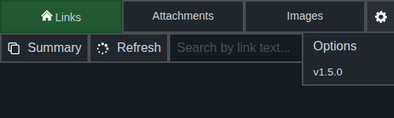
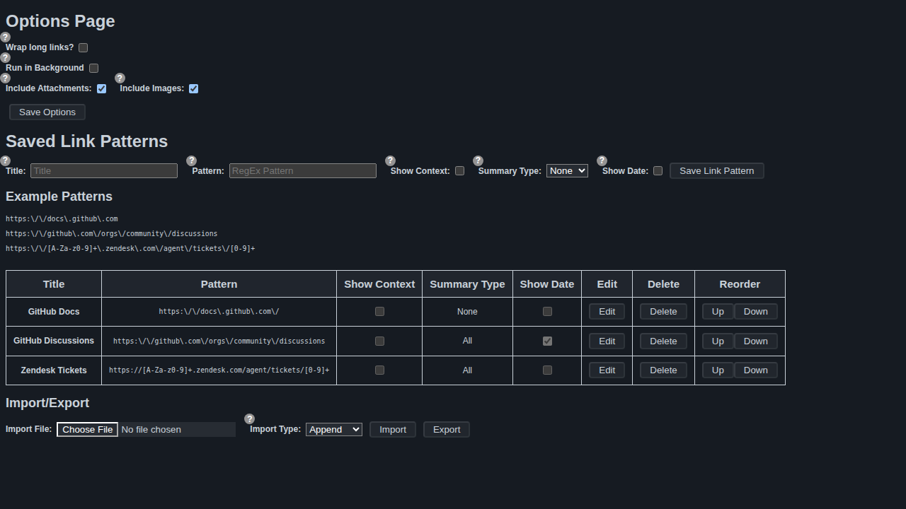
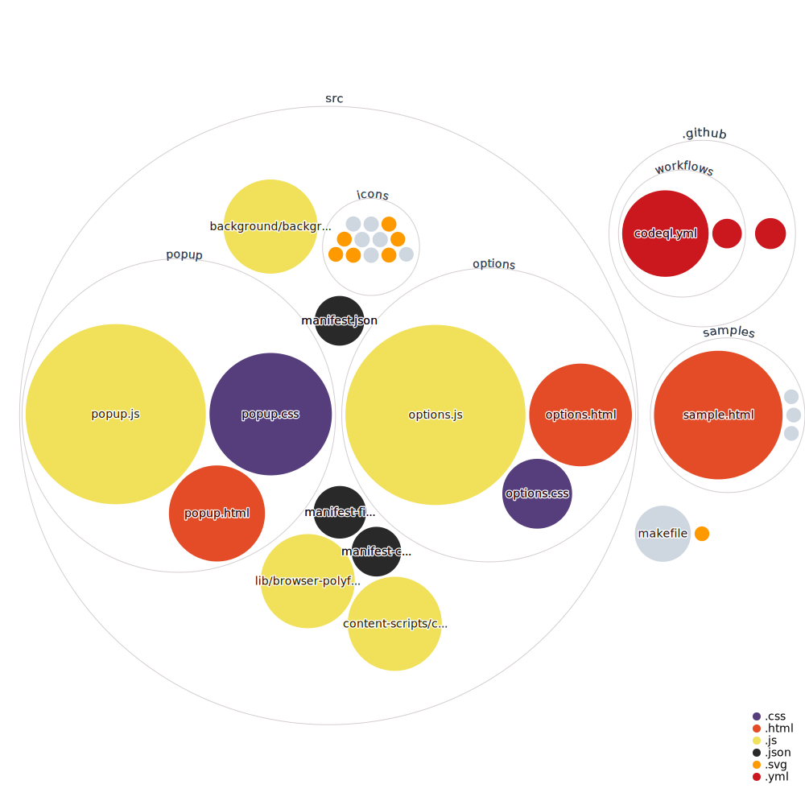

# Zendesk Link Collector 

This is a browser extension that collects links from a Zendesk ticket according to custom Regular Expression (regex) values. This tool's purpose is to help Zendesk users more easily handle _long_ tickets where links and/or attachments are key information.

## Installation
This extension can be installed from the [Firefox addons store](https://addons.mozilla.org/en-CA/firefox/addon/zendesk-link-collector/) or the [Chrome web store](https://chrome.google.com/webstore/detail/zendesk-link-collector/nckhapficnbbmcpapjnnegpagfcbjpja).

[](https://chrome.google.com/webstore/detail/zendesk-link-collector/nckhapficnbbmcpapjnnegpagfcbjpja) [](https://addons.mozilla.org/en-CA/firefox/addon/zendesk-link-collector/)

You can also manually [install it from the source code](#chrome-manual-installation).

## Configuration
Access the configuration page to set link regex patterns you would like to aggregate from tickets.

Some default link patterns will be available when you install the extension. You can also download [a sample JSON file containing the default patterns](./samples/link-patterns.json) to import from the configuration page.

### Google Chrome and Firefox

Click the ⚙️ icon in the top-right corner of the extension popup to open a dropdown menu. Select **Options** to open the configuration page.



The Options page includes global settings (wrap long links, run in background, include attachments/images) and your saved link patterns.



## Features

### Link Aggregation
- Links are aggregated according to custom regex patterns.
- No other chaos from the ticket is included in the link, only actual links are considered (`a` anchor elements).
    - Links can optionally display "context" when the "Show context?" checkbox option selected. This shows the surrounding text beside the link (the context is the parent HTML element of the `a` element).  
- Scroll to a link's source comment by clicking the spyglass icon (🔍) beside a link.
- Links pointing to the currently open ticket are automatically excluded.


### Search / Filtering
- Each tab has a search box that filters results as you type.
- Search is case-insensitive and matches against the displayed text.
- The Images and Attachments tabs search by file name.
- A clear button (⌫) resets the filter and restores all results.

### Attachment Aggregation
- Attachments are aggregated.
- Scroll to an attachment's source comment by clicking the spyglass icon beside a link.


### Image Aggregation
- Images attached to ticket comments are collected and displayed in the Images tab.
- Click an image thumbnail to preview it in Zendesk's built-in image viewer.

### Chrome Manual Installation
1.  Clone the repository or download and extract the ZIP file to your local machine.
2.  Open `chrome://extensions` in your Google Chrome browser.
3.  Turn on `Developer mode` by clicking the toggle in the top-right corner.
4.  Click on the `Load unpacked` button and select the `src` folder in the directory containing the extracted ZIP file.

### Firefox Manual Installation
1.  Clone the repository.
2.  Run `make dev` to build with the development-only `gecko.id` (loading the release ID as a temporary add-on can clobber your installed extension's stored data).
3.  Open `about:debugging#/runtime/this-firefox` in Firefox.
4.  Click `Load Temporary Add-on…` and select `build/firefox/manifest.json`.

## Building

The project uses a `makefile` to build for each target browser.
Building requires [`web-ext`](https://github.com/mozilla/web-ext) on
your `PATH` (`npm install -g web-ext`).

```bash
# Build release packages for both browsers
make build

# Build dev packages (uses a separate gecko ID for safe Firefox testing)
make dev

# Run the manifest / MV3 / Firefox lint
make lint
```

The repository deliberately does not commit a `package.json` or
`node_modules`; ESLint runs in CI via `npx`. To run it locally:

```bash
npx --yes -p eslint@^10 -p @eslint/js@^10 -p globals@^17 eslint src/
```

## Project Structure

The project is structured like a typical manifest v3 browser extension, with some slight differences. For example, we have separate browser-specific manifest files and a `makefile` to build for each target browser.

Below is a diagram of the project using [`githubocto/repo-visualizer`](https://github.com/githubocto/repo-visualizer/).


